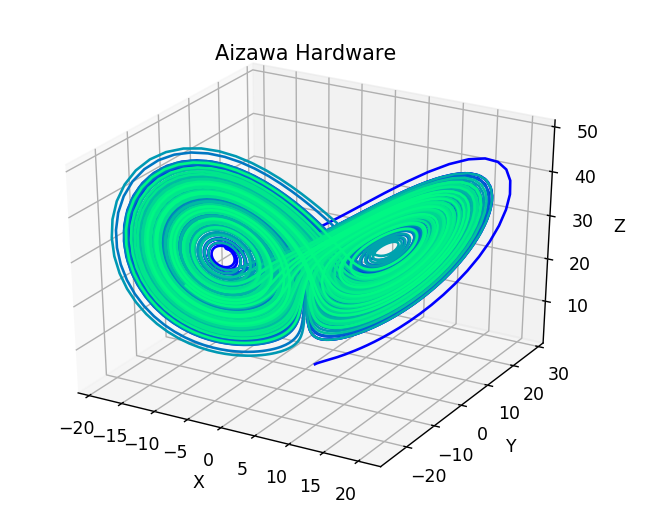

## Introduction
This project aims to implement a PDE (Partial Differential Equation) approximation, using established methods like RK4, Heun, Verlet.
This is done to simulate and showcase the concept of [Strange Attractors](https://www.dynamicmath.xyz/strange-attractors/), which are a special case of a PDE system. 
***
Lorenz Attractor
***

## Usage
The repository contains exampple foldares with pre-built .hwh and .bit files alongside jupyter notebooks going through the usage. The folders contain the System Generator .slx file, which can be used to build the given overlay.

## Requirements
- Matlab 2020a
- system generator 2020.1
- Vivado 2020.1
- PYNQ-Z2 board

## Limitations
Ther biggest current limitation of the implemented hardware accelerators is their reliance on the AXI4-Lite PS-PL interface, which is memory mapped and considerably slower than the AXI4-Stream interface. This provides a clear path for improvement, and potential for outpacing the equivalent software implementation.

